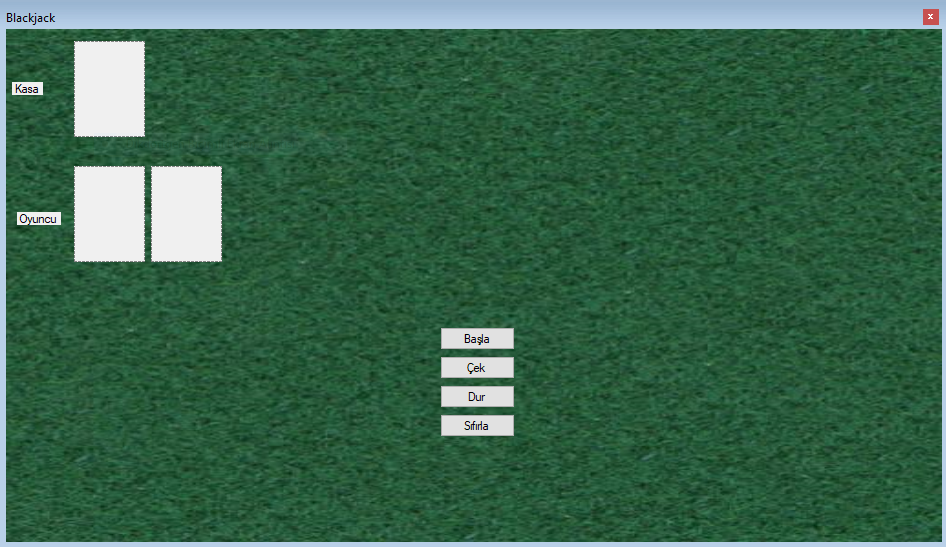

# Proje Adı
BlackJack C#FORM


## Açıklama

Blackjack windows Form olarak oynamak

## İçindekiler

- [Özellikler](#özellikler)
- [Kurulum](#kurulum)
- [Kullanım](#kullanım)
- [Örnekler](#örnekler)
- [Ekran Görüntüleri](#ekran-görüntüleri)
- [Katkıda Bulunanlar](#katkıda-bulunanlar)
- [Lisans](#lisans)

## Özellikler

- 🚀 Hızlı ve kullanıcı dostu arayüz  
- 🔧 Kolay kurulum ve yapılandırma  
- 📊 Gerçek zamanlı veri görselleştirme  
- 🔒 Güvenli veri işleme mekanizmaları  

## Kurulum

1. Depoyu klonlayın  
   ```bash
   git clone https://github.com/KULLANICI_ADI/REPO_ADI.git
   ```
2. Proje dizinine gidin  
   ```bash
   cd REPO_ADI
   ```
3. Gerekli bağımlılıkları yükleyin  
   ```bash
   pip install -r requirements.txt
   ```

## Kullanım

```bash
python main.py
```

- Açılan arayüzde gerekli ayarları yaptıktan sonra **Başlat** butonuna tıklayın.  
- İşlemler tamamlandığında sonuçlar `output/` klasöründe saklanacaktır.

## Örnekler

Detaylı örnek senaryoları `examples/` klasöründe bulabilirsiniz.

## Ekran Görüntüleri



## Katkıda Bulunanlar

- [Dmr.Erdinc](https://github.com/DmrErdinc) – Proje sahibi ve geliştirici

## Lisans

Bu proje MIT Lisansı ile lisanslanmıştır. Ayrıntılar için `LICENSE` dosyasına bakınız.
